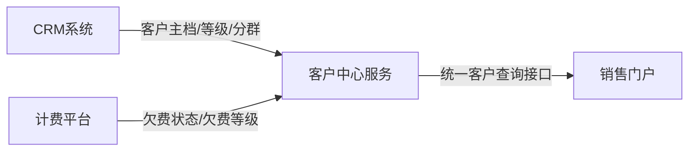
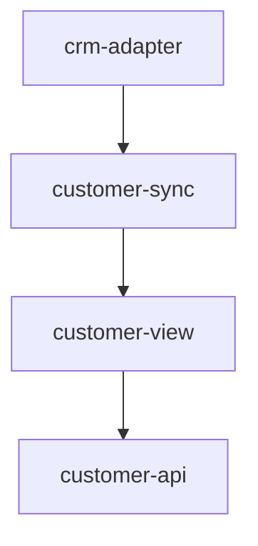

# 客户中心域架构

## 系统关系

客户中心域由两个上游系统和两个本地系统组成：

1. CRM系统：提供客户主档、客户等级、客户分群。
2. 计费平台：提供账单、欠费状态、欠费等级。
3. 客户中心服务：接收上游数据，形成统一客户视图。
4. 销售门户：调用客户中心服务，对销售展示客户信息。

## 本地服务内部结构

模块职责：

1. `crm-adapter`：封装 CRM API 和事件格式。
2. `customer-sync`：处理外部字段映射、落库和幂等。
3. `customer-view`：拼装统一客户视图。
4. `customer-api`：对销售门户暴露查询接口。

## 架构边界

1. 上游系统负责定义业务事实。
2. 客户中心服务负责统一视图和查询能力。
3. 销售门户负责消费统一视图，不直接对接 CRM 和计费平台。

## 近期高频改动位置

1. CRM 新增字段：`crm-adapter` + `customer-sync` + `customer-view`
2. 销售新增筛选项：`customer-view` + `customer-api` + 销售门户
3. 计费新增欠费字段：计费接入模块 + `customer-view`

## 不在本域内解决的问题

1. CRM 等级计算规则。
2. 计费欠费等级算法。
3. 上游系统的数据修正策略。

## 相关文档

1. [业务全景/系统地图.md](./业务全景/系统地图.md)
2. [本地代码落点/客户中心服务.md](./本地代码落点/客户中心服务.md)
