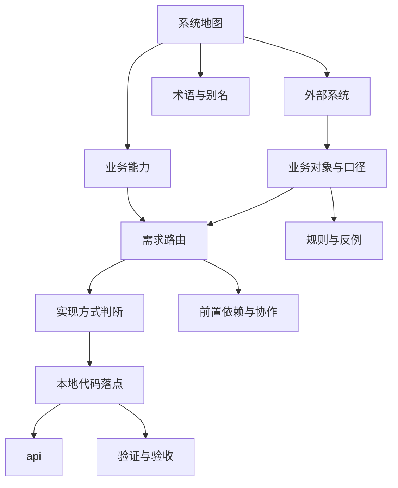

# 客户中心域文档地图

## 按问题查文档

| 问题 | 先读文档 | 结论类型 |
|---|---|---|
| 需求里提到的简称到底指哪个系统或对象 | `术语与别名/*` | 标准对象映射 |
| 这个系统是不是上游外部系统 | `外部系统/*` | 是否可直接修改 |
| 这个字段谁定义 | `业务对象与口径/*` | 事实来源 |
| 这类变化谁负责实现 | `业务能力/*` | 主责系统 |
| 这次到底要改代码还是改配置/等上游 | `实现方式判断/*` | 实现方式 |
| 变化在链路哪一步进入本地 | `流程与交接/*` | 责任交接点 |
| 本地通过什么对接上游 | `集成触点/*` | API / 事件 / 文件 |
| 本地代码该改哪里 | `本地代码落点/*` | 仓库和模块 |
| 有没有前置阻塞项 | `前置依赖与协作/*` | 可实施性 |
| 这类需求通常怎么分流 | `需求路由/*` | 标准处理路径 |
| 哪些错误路径要排除 | `规则与反例/*` | 反例和约束 |
| 改完要怎么验收 | `验证与验收/*` | 验收闭环 |

## 文档依赖关系

## 读取优先级

当同一需求同时涉及多个分区时，优先级如下：

1. `业务对象与口径`
2. `外部系统`
3. `业务能力`
4. `需求路由`
5. `本地代码落点`
6. `规则与反例`

原因：

1. 先确定语义和事实来源。
2. 再确定系统边界。
3. 再决定本地落点。

## 相关文档

1. [index.md](./index.md)
2. [getting-started.md](./getting-started.md)
