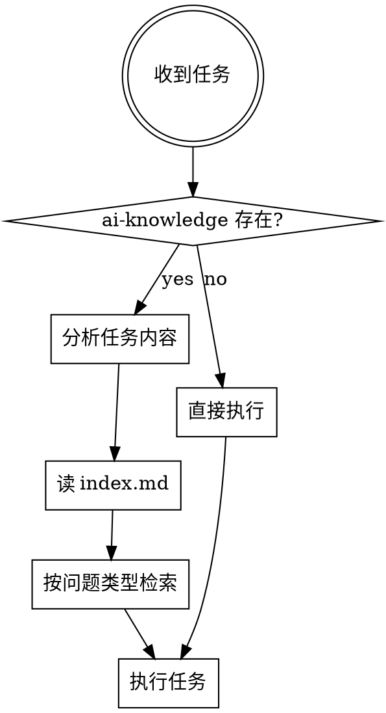

# 项目知识库使用指南

## Overview

本 Skill 指导 AI Agent 如何检索和引用 `ai-knowledge/` 知识库，帮助 Agent 在处理任何任务时获得仓库上下文。

**核心原则**：知识库的第一个入口是 `index.md`，不是直接跳到某个知识文件。

知识库帮助 Agent 回答以下问题（无证据猜测的高风险场景）：
- 需求可能关联哪些仓库内可见能力
- 需求中的业务概念在仓库中如何体现
- 当前仓库有哪些可见能力边界
- 当前仓库与哪些外部系统存在交互
- 当前仓库有哪些可见约束
- 仓库内可见能力之间有什么关系
- 核心业务实体之间有什么关联关系

## 知识库结构

```
ai-knowledge/
├── index.md              # 全局总索引（第一个入口）
├── architecture.md       # 架构概览（包级元知识）
├── modules.json          # [可选] 模块拓扑（仅紧耦合多模块项目）
├── project-context.json  # 项目类型上下文
├── capabilities/         # 能力目录
├── concepts/             # 概念知识
├── boundaries/           # 边界知识
├── external-systems/     # 外部系统交互
├── constraints/          # 约束知识
├── relations/            # 能力关系
├── data-model/           # 数据模型
└── workflows/            # 跨域业务流程
```

**两层索引体系**：
1. **全局索引**（`index.md`）：Agent 第一个打开的文件
2. **类型索引**（`_index.md`）：各知识类型目录的内部索引

### modules.json（多模块项目）

**仅紧耦合多模块项目需要此文件**。松耦合模式和单模块项目不需要。

modules.json 记录仓库内各模块的路径、角色、依赖关系和入口，帮助 Agent：
- 理解仓库的模块组织方式
- 知道哪些模块可以独立部署（deployable），哪些是共享库（shared）
- 查询模块间的依赖关系
- 定位各模块的启动入口

典型结构：
```json
{
  "moduleCount": 7,
  "modules": [
    {
      "name": "mall-admin",
      "path": "mall-admin/",
      "role": "deployable",
      "dependencies": ["mall-mbg", "mall-security"],
      "entryPoint": "MallAdminApplication.java"
    },
    {
      "name": "mall-mbg",
      "path": "mall-mbg/",
      "role": "shared",
      "usedBy": ["mall-admin", "mall-portal"]
    }
  ]
}
```

Agent 使用场景：
- 收到"修改 mall-admin 模块"任务 → 查 modules.json 确认依赖关系
- 需要修改共享模块 → 查 modules.json 的 usedBy 字段，评估影响范围
- 需要定位启动类 → 查 modules.json 的 entryPoint 字段

## When to Use



## 检索策略

### 第一步：读取 index.md

**位置**：`ai-knowledge/index.md`

index.md 提供两个检索视角：
- **业务域导航**：按业务域聚合跨类型知识，快速定位该域相关的所有文件
- **按类型索引**：按知识类型列出所有条目概要

Agent 根据任务内容选择检索入口：
- 任务涉及某个业务域（如"订单相关"）→ 业务域导航表
- 任务涉及某个知识类型（如"有哪些约束"）→ 按类型索引表

### 第二步：按问题类型检索

Agent 在处理任务时会面临不同类型的问题，根据问题类型选择需要深入的知识：

| 问题类型 | 需要的知识类型 | 检索方式 |
|----------|----------------|----------|
| "需求涉及哪些能力？" | 能力目录 | 业务域导航 → capabilities/ |
| "这个术语/概念是什么意思？" | 概念知识、术语速查 | 业务域导航 → concepts/ |
| "这个能力有什么约束/规则？" | 约束知识 | 业务域导航 → constraints/ |
| "这些能力之间有什么关系？" | 能力关系、跨域流程 | 按类型索引 → relations/、workflows/ |
| "修改这个数据会影响什么？" | 数据模型 | 按类型索引 → data-model/ |
| "项目整体结构是怎样的？" | 架构概览 | architecture.md |
| "这个能力能做到什么程度？" | 边界知识 | 业务域导航 → boundaries/ |
| "涉及哪些外部系统？" | 外部系统交互 | 按类型索引 → external-systems/ |

**注意**：Agent 不会明确知道自己在"Harness 阶段"，而是根据任务内容自动判断需要回答什么问题，然后检索对应知识。

### 第三步：验证知识适用性

知识条目包含以下字段帮助 Agent 判断适用性：
- **适用范围**：说明在什么场景下生效
- **证据**：链接到代码位置，Agent 可验证知识是否过期

## 各知识类型用途

| 知识类型 | 解决的问题 | 典型使用场景 |
|----------|------------|--------------|
| 架构概览 | 项目整体结构、技术栈、编码约定 | 新功能开发前确定代码位置 |
| 能力目录 | 仓库有哪些业务能力、入口在哪 | 判断需求关联哪些能力 |
| 概念知识 | 业务术语定义、代码映射 | 需求澄清阶段理解术语 |
| 边界知识 | 已有能力的局限性 | 判断需求是否超出现有能力 |
| 外部系统交互 | 与哪些外部系统有交互 | 评估跨系统影响 |
| 红束知识 | 代码体现的业务规则 | 避免违反现有约束 |
| 能力关系 | 能力之间的依赖组合关系 | 评估联动影响 |
| 数据模型 | 实体之间的关联关系 | 设计数据变更方案 |
| 跨域流程 | 跨多个能力域的业务路径 | 理解端到端业务流程 |

## 典型使用流程

### 场景 1：理解涉及陌生术语的需求

**任务**：收到需求"优化学生绑定老师的流程"

**问题**："师徒关系"是什么意思？现有绑定有什么规则？

**检索步骤**：
1. 打开 `index.md`
2. 在业务域导航表中找到"用户管理"域
3. 读取概念知识 `concepts/teacher-student-bind.md` 理解术语定义
4. 读取约束知识 `constraints/bind-limit.md` 了解现有规则
5. 读取能力目录 `capabilities/user.md` 知道绑定入口在哪里

### 场景 2：新功能开发

**任务**：收到需求"新增优惠券功能"

**问题**：优惠券涉及哪些现有能力？有什么约束？

**检索步骤**：
1. 打开 `index.md`
2. 在业务域导航表中找到"订单管理"域（优惠券属于订单）
3. 读取能力目录 `capabilities/order.md` 了解现有订单能力
4. 读取约束知识 `constraints/_index.md` 查找订单相关约束
5. 读取数据模型 `data-model/order.md` 了解订单实体结构
4. 读取约束知识目录 `constraints/_index.md` 查找订单相关约束
5. 记录现有能力和约束，避免 spec 与现有行为冲突

### 场景 3：修改现有代码

**任务**：收到需求"修改订单提交逻辑"

**问题**：订单提交入口在哪里？涉及哪些数据？

**检索步骤**：
1. 打开 `index.md`，查看架构概览链接
2. 读取 `architecture.md` 了解项目分层约定
3. 在业务域导航表中找到"订单管理"域
4. 读取能力目录 `capabilities/order.md` 定位订单提交入口
5. 读取数据模型 `data-model/order.md` 了解实体关联

## Quick Reference

### 索引文件用途

| 文件 | 用途 | 何时读取 |
|------|------|----------|
| `index.md` | 全局总索引，业务域导航 | 任何任务开始时 |
| `_index.md` | 类型内部索引 | 需要扫描某类型全部条目时 |
| `_glossary.md` | 术语速查表 | 需求澄清阶段快速确认术语 |
| `architecture.md` | 架构概览 | 需要理解项目整体结构时 |

### 知识价值判断

不是所有从代码提取的信息都值得读取。知识库只沉淀 Agent 难以在 3 分钟内从代码中独立得出结论的信息。

**不值得深入的知识**：
- 简单枚举（值少于 5 个且命名自解释）
- 操作清单翻译（只是方法名翻译）
- 工程惯例约束（任何同类型项目都有的通用约束）

**值得深入的知识**：
- 跨文件综合（需要阅读 3+ 文件才能理解的业务全貌）
- 非显而易见的业务规则（代码中的特殊处理逻辑）
- 外部系统交互细节（SDK 使用方式、回调处理）
- 跨域业务流程（跨越多个能力域的端到端路径）

## Common Mistakes

| 错误 | 正确做法 |
|------|----------|
| 直接跳到某个知识文件 | 先读 `index.md` 建立全局认知 |
| 只读架构概览不看能力目录 | 架构概览提供全局视图，能力目录提供具体入口 |
| 知识条目全文加载 | 只读取需要的部分，知识库支持分块加载 |
| 知识内容当作代码索引 | 知识库是系统理解辅助，不替代代码搜索 |
| 假设知识完全覆盖仓库 | 知识库只沉淀有证据支撑的确定知识 |

## Checklist

任务开始前确认：

- [ ] 已读取 `index.md` 全局索引
- [ ] 已根据任务阶段确定需要深入的知识类型
- [ ] 已使用业务域导航定位相关知识文件
- [ ] 已检查知识的适用范围是否匹配当前场景
- [ ] 已验证知识证据链接是否指向有效代码位置

**如果以上任一项未完成，先完成检索再执行任务。**